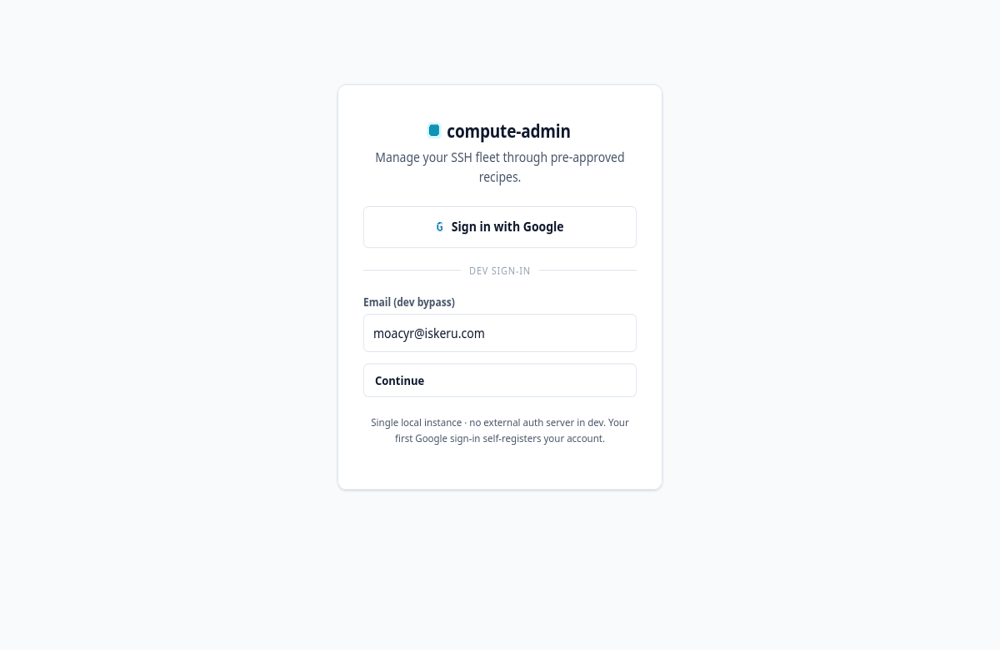
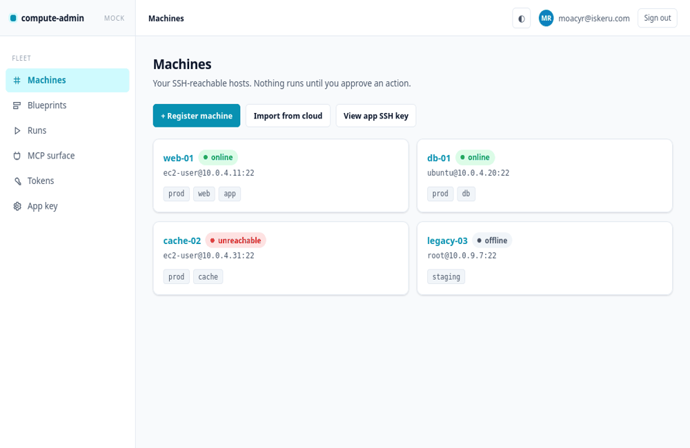
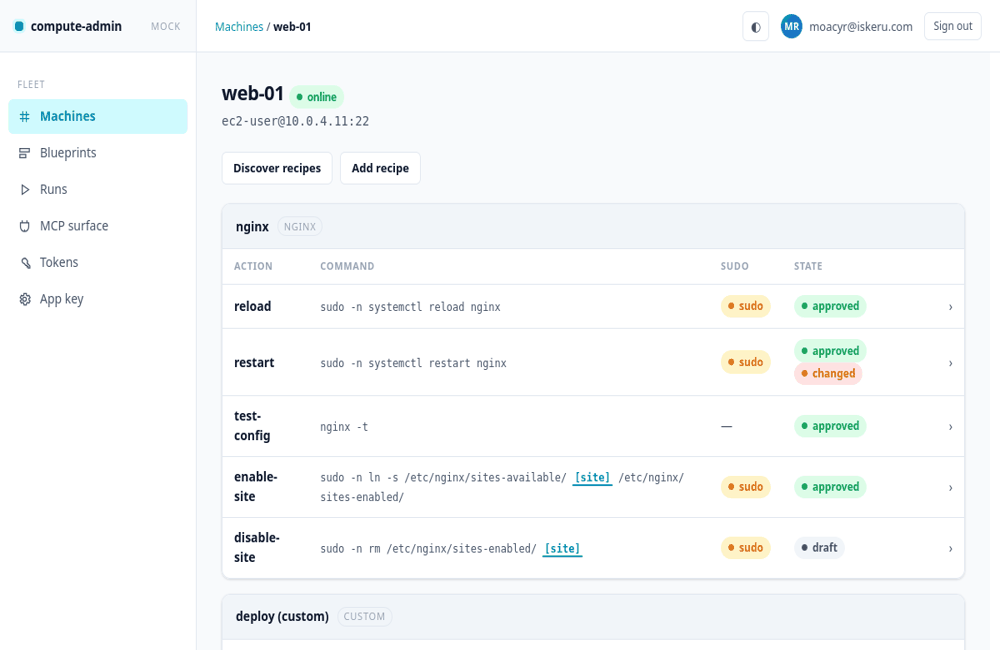

# compute-admin

An MCP server (with a thin web UI) for managing a fleet of SSH-reachable machines
through **pre-approved recipes and scripts**. An AI agent — or a human — can list
machines, discover what runs on them, and execute approved operations (restart
nginx, add a site, run a custom `deploy.sh`, …). The catch that makes it safe to
hand to an agent: **execution is gated by a UI-only approval.** Anything can be
*registered* over MCP, but only a human clicking *approve* in the UI turns an
action into something MCP is allowed to run.

## Demo

> Captured from the **design mock** (spec 012). The UI shell it previews is now
> built and wired to the live backend on `main`; these clips show the intended UX.

**Login, then authorize an agent over MCP** — you sign in; an MCP client requests
pairing; you approve it and a per-user token is issued. The agent never
authenticates itself.



**Run an approved recipe** — open an approved nginx action and run it; output
streams live.



**Run a parameterized action** — pick a validated parameter (`site`); the exact
command previews as you choose, then runs.



## What it does

- **Register machines** — an SSH-reachable host (host, port, login user), tagged
  with free-form labels. The app owns a single keypair; you install its public
  key into each box's `authorized_keys`.
- **Cloud import (discovery provider)** — pull instances (and their cloud tags)
  from a provider account to register machines in bulk. Providers: **AWS**, then
  **GCP** and **MagaluCloud**. Import never mutates the cloud side.
- **Add recipes** — a recipe is a named bundle of **actions** on a machine.
  - *Built-in* recipe types: **nginx, docker, database (mysql/mariadb/postgres),
    cron.** Their actions are auto-discovered by SSHing into the box and
    **proposing** recipes + default actions (nothing runs, nothing is approved
    until you say so).
  - *Custom* recipes: your own script on the box (e.g.
    `/home/ec2-user/app/minhabufunfa/run.sh`) wrapped as an action.
- **Approve, then run** — an action is a command template with **typed,
  validated parameters** and an optional per-action `sudo` flag. Once approved in
  the UI, it can be run. Runs are **asynchronous jobs** with **live-streamed**
  output (stdout/stderr) and a recorded exit code.
- **Full audit** — every approval, config change, and each run (who/what/when/
  exit code, MCP vs UI) is recorded.

## Trust model in one paragraph

Each user signs in and works only within his own machines and recipes (nothing is
shared between users). Creating machines and recipes is allowed from **either** MCP
or the UI. **Approval is UI-only** — there is no MCP tool that approves, and it
requires a signed-in UI session (the per-user MCP token cannot reach it). MCP can *see* unapproved
actions (marked `pending_approval`) so an agent knows they exist and can ask you
to approve them, but attempting to run one is refused. MCP can run **only**
approved actions, with parameters validated against the action's declared schema.
See [ARCH.md](./ARCH.md) for the enforcement points and the **deferred-risk
register** of everything currently left insecure on purpose.

## Stack

- **Spring Boot 3.5 / Java 25.** JAX-RS via **RESTEasy** (the API is `*RS`
  `@Component` resources under `/api`); **no Spring Web MVC controllers**. UI is a
  static HTML + vanilla-JS shell rendered from JSON.
- **MCP server** over **HTTP/SSE**, wired with the **MCP Java SDK** as a plain
  servlet (kept off Spring MVC, sitting beside RESTEasy on the same Tomcat).
- **H2 file** database, **Flyway** migrations, **JPA + Hibernate Envers**
  (validity strategy) for audit, **Lombok**.
- **SSH** via **Apache MINA SSHD**; a single app-owned **ed25519** keypair.
- **User-based:** Google sign-in for the UI, a per-user personal token for MCP;
  each user owns his own machines/recipes, nothing shared. Still a single **local**
  instance (transport hardening deferred). See ARCH.md spec 011.

## Status

The **v1 core is built and on `main`**: the MCP transport, user accounts &
ownership, machine registry & SSH adapter, the recipe/action approval gate,
the execution engine, auto-discovery, custom & blueprint recipes, the MCP
tool surface, and the web UI shell (specs 001–012). Runtime hardening
(spec 013) and cloud import (spec 009) are the tracked follow-ups. Architecture
is specified in [ARCH.md](./ARCH.md); each feature lands as a numbered spec —
see the [spec catalog](./specs/README.md) for status.

## Running

```bash
mvn spring-boot:run -Dspring-boot.run.profiles=dev
```

Dev uses the H2 file DB; the app prints its public SSH key on first boot for you
to install on target machines. See [CLAUDE.md](./CLAUDE.md) for the full run,
health-check, and SSH-verify recipes.
