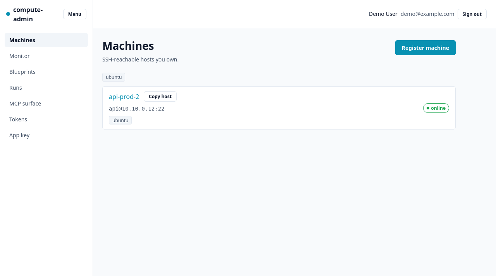
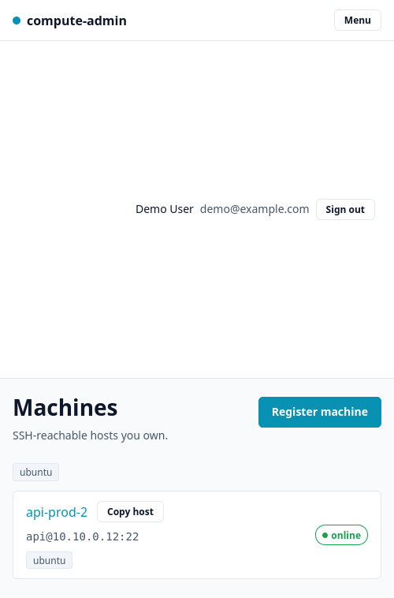
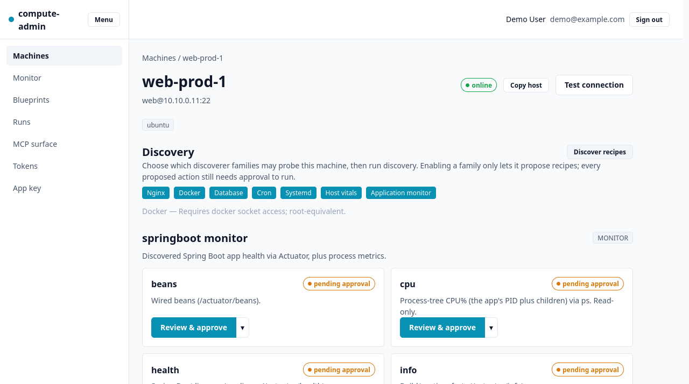
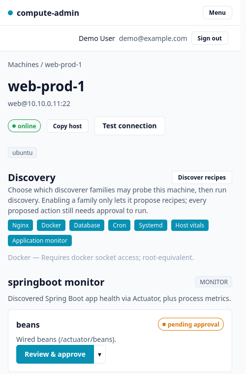
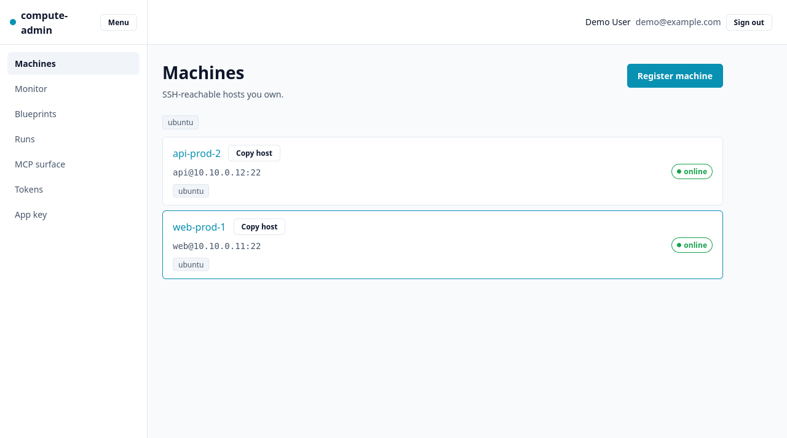
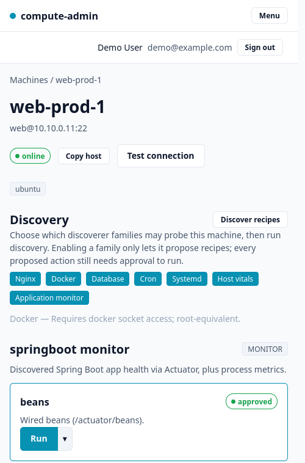
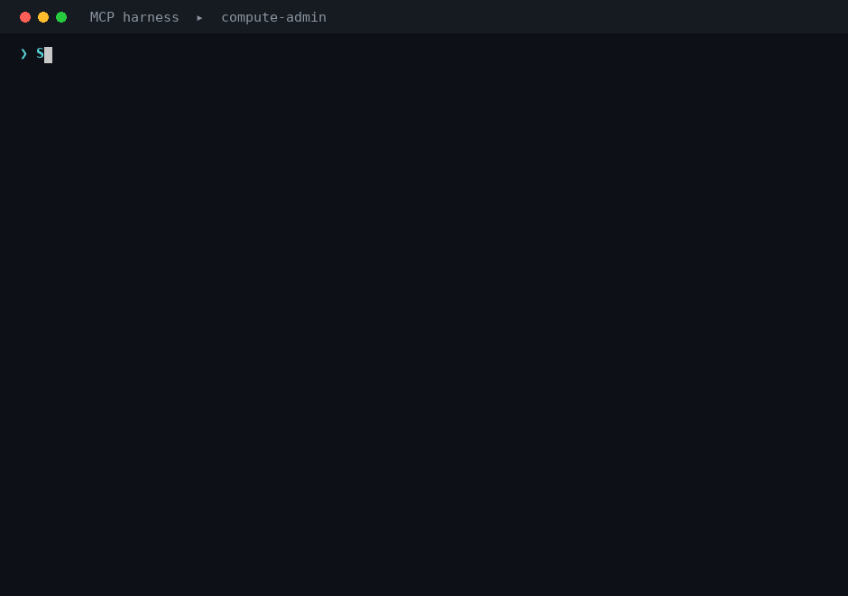

# compute-admin — demo & GIF recordings

A **re-runnable** harness that boots compute-admin against a **fake fleet** (no real
SSH targets) and records short GIFs of the core flows. Nothing here is part of the app
build — it is dev/demo tooling. **It is not wired up or validated yet** (see
[Status](#status)); this document + [`fake-fleet.md`](./fake-fleet.md) +
[`steps.md`](./steps.md) are the plan and the maintenance contract.

## What we record (3 flows × 2 viewports = 6 GIFs)

Every flow is recorded at **both** viewports — desktop and mobile — so the same steps
must work in both layouts (the mobile pass exercises the spec-043 responsive UI: the
**Menu** nav toggle, single-column card stacking, and the **bottom-sheet** consumer
drawer). Outputs are named `NN-slug.desktop.gif` / `NN-slug.mobile.gif`.

| # | Flow (→ `.desktop.gif` + `.mobile.gif`) | Shows | Steps |
|---|-----|-------|-------|
| 1 | `01-add-machine-discover` | Register a machine, then **Discover recipes** → proposed monitor/app/docker recipes appear | [steps.md §1](./steps.md) |
| 2 | `02-enable-monitor` | Enable the discoverer families + **approve** the monitor recipes/actions through the gate | [steps.md §2](./steps.md) |
| 3 | `03-monitor-fleet` | The **Monitor** view: 2 machines, **>1 app each**, and a **shared database on each** — one **docker**, one **native** — on the RAM/CPU/disk axes; open a consumer drawer | [steps.md §3](./steps.md) |

**Viewports** (set by the recorder, see [`record.py`](./record.py)):
- **desktop** — 1280×800.
- **mobile** — 390×844 (iPhone-class), `deviceScaleFactor` 2 — below the spec-043
  `--bp-sm` (480px) breakpoint, so the Menu nav + stacked/bottom-sheet layout render.

## Recordings

Produced from the `demo` profile driven by the `test-flow-headless` recorder (2026-07-14).
Desktop = 1280×800, mobile = 390×844 (Menu nav + bottom-sheet drawer).

### 1 · Add machine + discover
| Desktop | Mobile |
|---|---|
|  |  |

### 2 · Enable / approve the monitors
| Desktop | Mobile |
|---|---|
|  |  |

### 3 · Monitor fleet view
| Desktop | Mobile |
|---|---|
|  |  |

> **Caveats visible in the flow-3 recordings.**
> - `api-prod-2` (pre-seeded, fully approved) shows **populated** RAM/CPU/disk bars with the
>   per-app + other/system breakdown; `web-prod-1` (just onboarded on camera, only its first
>   monitors approved in flow 2) shows its apps but **empty bars** — approving its remaining
>   host-vitals would populate it. Re-record if you want both hosts full.
> - api-prod-2's **native** `postgres` shows as an app, not in the Databases lens — the
>   native-datastore classification gap (see [`fake-fleet.md`](./fake-fleet.md) and concern 040).
>   web-prod-1's **docker** `postgres` does appear in the Databases *Shared* band.

### 4 · MCP — register custom scripts (simulated harness)



A **simulated** MCP-client conversation — rendered by [`mcp-terminal.py`](./mcp-terminal.py)
(Pillow → ffmpeg; no live MCP session) — showing an agent register a `CUSTOM`
`app-control` recipe with `start` (`/opt/app/run.sh`) and `stop` (`/opt/app/kill.sh`) via
`add_recipe` / `add_action`, then be **refused** by `run_action` because the actions are
`PENDING_APPROVAL` and **approval is UI-only** (there is no MCP approve tool — GateArchTest).
It is grounded in the real tool names, the S9 machine view (host/port/login hidden), and the
gate invariant; edit the `CONVO` list in `mcp-terminal.py` to change the script. Regenerate:
`python3 demo/mcp-terminal.py --out demo/out/04-mcp-custom-scripts.gif`.

The target end-state the recordings depict is the fake fleet defined in
[`fake-fleet.md`](./fake-fleet.md):
- **web-prod-1** — apps `checkout-api` (springboot) + `web-frontend` (generic) + a
  **docker** shared datastore (`postgres`, used by both).
- **api-prod-2** — apps `orders-api` (springboot) + `billing-worker` (generic) + a
  **native** shared datastore (native `postgres` process, used by both).

## How it runs (the pieces)

1. **App under a `demo` Spring profile** — boots the real app but swaps the MINA
   `SshExecutor` for a **canned executor** that returns scripted stdout per
   (host, command), so discovery + the monitor polls render the fake fleet
   deterministically. One machine (`api-prod-2`) is pre-seeded so GIF 3 shows two
   machines; `web-prod-1` is added live during GIF 1. **See [`fake-fleet.md`](./fake-fleet.md)
   for the profile + the full command→output contract.**
2. **Browser driver** — a real Firefox via **geckodriver**, same stack the
   `test-flow-headless` agent uses. Either:
   - invoke the **`test-flow-headless` agent** with the relevant section of
     [`steps.md`](./steps.md) as its interaction steps (it drives Firefox + returns a
     gif/screenshot), **or**
   - run the standalone [`record.py`](./record.py) fallback (geckodriver + `ffmpeg`).
   The agent does **not** start the server, seed data, or publish — the runner (below)
   does all three.
3. **GIF encoding** — `ffmpeg` turns captured frames / an `x11grab` capture into an
   optimized gif (palette pass). See `record.py`.

## Run procedure (for whoever executes it later)

```bash
# 0. prerequisites: firefox, geckodriver, ffmpeg on PATH; a fresh DB
#    (the demo profile seeds its own users/machines — do NOT point at real ./data)
# 1. boot the app with the demo profile on a dedicated port. The demo profile's own
#    datasource already points at the throwaway ./data-demo (application-demo.yml), so
#    there is no separate DB-dir flag — it never touches the real ./data.
PORT=8099 mvn -q spring-boot:run -Dspring-boot.run.profiles=demo
# 2. wait for `Started Application`; the DemoSeeder logs `[demo] …` and pre-seeds
#    api-prod-2. Log in with the seeded demo user (see fake-fleet.md).
# 3. record each flow at BOTH viewports — agent per steps.md §N, or:
python3 demo/record.py --steps demo/steps.md --section 1 --viewport desktop --out demo/out/01-add-machine-discover.desktop.gif
python3 demo/record.py --steps demo/steps.md --section 1 --viewport mobile  --out demo/out/01-add-machine-discover.mobile.gif
#    (…repeat for sections 2 and 3)
# 4. review the gifs in demo/out/, then commit the .gif files (or attach to the PR/README)
# 5. tear down: stop the app, `rm -rf ./data-demo`
```

## Status

**Built, validated, and recorded** (all 6 GIFs in [`out/`](./out), embedded under [Recordings](#recordings)).
- [x] Implement the `demo`-profile `CannedSshExecutor` + seeder per
      [`fake-fleet.md`](./fake-fleet.md) and validate its outputs against the live
      parsers (the contract table lists the exact parser for each command). Done in
      `src/main/java/com/iskeru/computeadmin/demo/` (`CannedSshExecutor`, `DemoFleet`,
      `DemoSeeder`), all `@Profile("demo")`. Validated end-to-end over the REST API:
      register→discover→approve→`GET /api/monitor`→poll; RAM/CPU/disk outputs parse.
- [x] Confirm the demo-DB override exists so the demo never touches real `./data`.
      `application-demo.yml` points the datasource at `./data-demo` (Flyway still owns
      the schema). `./data-demo` is gitignored; reset the demo by deleting it.
- [x] First recording pass; committed `demo/out/*.gif` (6 GIFs, see [Recordings](#recordings)).
      Flow-3 caveats noted there (web-prod-1 bars empty until its host-vitals are approved;
      native DB shows as an app).

> **Known deviation from `fake-fleet.md` (native datastore role).** api-prod-2's native
> `postgres` surfaces as a **native `role=APP` consumer** (source `NATIVE`), not a
> `role=DATABASE` one: the code has no native-database consumer path
> (`MonitorConsumerView.ofNativeApp` always sets `role=APP`; `role=DATABASE`/`SHARED`
> come only from the docker path). So the Databases lens **Shared** band shows only
> web-prod-1's docker postgres; api-prod-2's postgres appears in the Apps lens. Source
> (docker vs native) and the SHARED docker datastore are exactly as specified. See the
> note under the contract table in [`fake-fleet.md`](./fake-fleet.md).

## Maintenance — what to check when the app changes

The recordings depend on stable **routes, visible button/link text, and the
command→output contract**. When any of these change, update the mapped file:

| If this changes… | Update | Depends on |
|---|---|---|
| Register form fields / route `#/machines/register` | [steps.md §1](./steps.md) | `app.js` `screenRegisterMachine` |
| The **Discover recipes** button / Discovery panel | [steps.md §1–2](./steps.md) | `app.js` `discoverySection` (spec-035) |
| Approval flow / button labels (Submit/Approve/Revoke) | [steps.md §2](./steps.md) | `app.js` `screenActionDetail` / `act()` — **spec-044 will move this into a drawer + split-button; rewrite §2 then** |
| Monitor route/controls, consumer drawer, bars | [steps.md §3](./steps.md) | `app.js` monitor screen + `openConsumerDrawer` (spec-034/037/041) |
| What a discoverer/monitor probe runs, or a parser's expected format | the **contract table** in [fake-fleet.md](./fake-fleet.md) | the discoverers in `discovery/service/*` and the parsers in `app.js` |
| Nav labels / login flow | [steps.md](./steps.md) header | `index.html` nav, `app.js` login |

Keep the contract table's "source parser" column accurate — it is the single place that
tells a future maintainer *why* each canned output is shaped the way it is.
